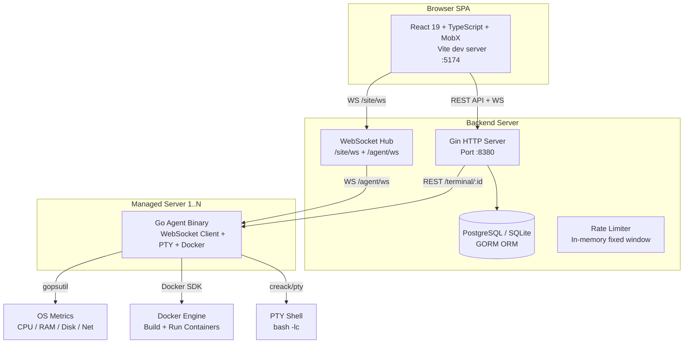
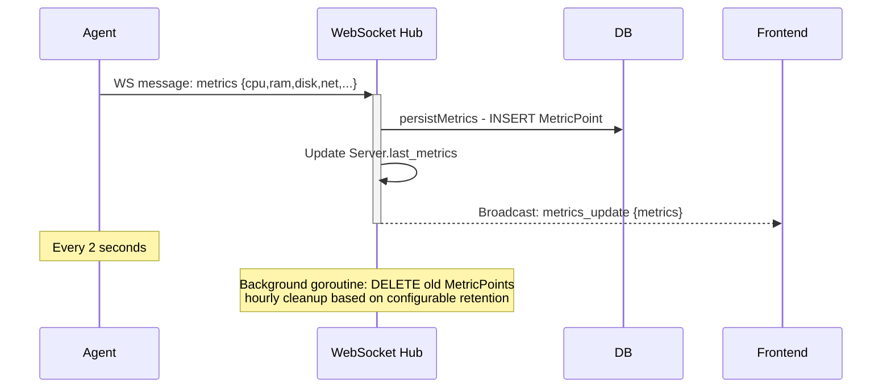
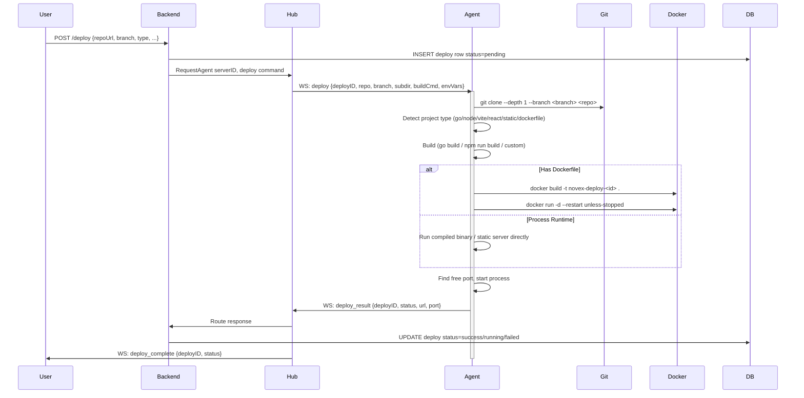
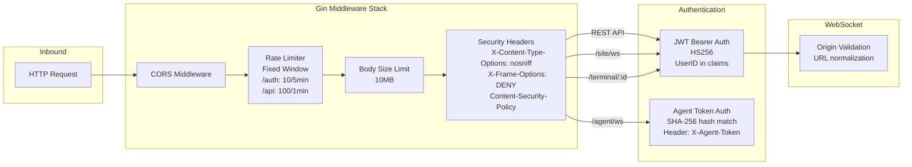
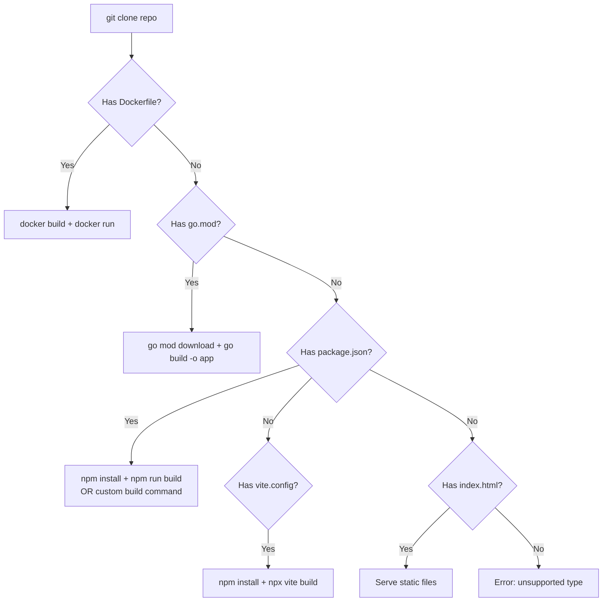

# NovexPanel — Architectural Review & Code Overview

**Project**: NovexPanel — a self-hosted server management panel  
**Stack**: Go 1.22 (backend) + React 19 / TypeScript / MobX (frontend)  
**Author**: botoli  
**Review date**: 2026-04-28  

---

## 1. System Architecture

### 1.1 High-Level Overview

NovexPanel follows a **3-tier architecture** with a central Go backend, a React SPA frontend, and lightweight Go agents deployed on managed servers.



### 1.2 Communication Channels

| Channel | Direction | Protocol | Endpoint | Auth |
|---------|-----------|----------|----------|------|
| Frontend ↔ Backend (data) | Bidirectional | REST (JSON) | `POST/GET/PATCH/DELETE /api/*` | JWT Bearer |
| Frontend ↔ Backend (realtime) | Bidirectional | WebSocket | `/site/ws` | JWT query param |
| Agent ↔ Backend (control) | Bidirectional | WebSocket | `/agent/ws` | Agent Token header |
| Browser ↔ Agent (direct PTY) | Bidirectional | WebSocket | `/terminal/:id` | JWT query param |
| Backend → Agent (commands) | Request/Response | WS Envelope | Via Hub `RequestAgent()` | N/A (inside WS) |

### 1.3 Data Flow — Real-Time Metrics



### 1.4 Data Flow — Deployment Pipeline



---

## 2. Backend Architecture

### 2.1 Module Structure

```
backend/
├── cmd/
│   ├── agent/main.go      # Agent binary (2730 lines) - deployed on managed servers
│   └── server/main.go     # Backend binary (63 lines) - entry point
├── internal/
│   ├── app/               # Core application logic
│   │   ├── app.go             # Router, middleware setup, App struct (183 lines)
│   │   ├── hub.go             # WebSocket hub: agent/site clients, pub/sub (611 lines)
│   │   ├── auth_handlers.go   # Register, Login, Token CRUD (355 lines)
│   │   ├── ws_handlers.go     # WS message routing, metrics persistence (543 lines)
│   │   ├── server_handlers.go # Server CRUD, metrics history, commands (822 lines)
│   │   ├── deploy_handlers.go # Deploy CRUD, validation (802 lines)
│   │   ├── terminal_ws_handler.go # Direct PTY WS handler (359 lines)
│   │   ├── security_middleware.go  # Rate limiter, body limits, security headers (169 lines)
│   │   ├── ws_security.go     # WS origin validation (100 lines)
│   │   └── utils.go           # parseUintFromString, parseRemoteIP (20 lines)
│   ├── auth/               # Authentication primitives
│   │   ├── jwt.go              # JWT create/parse (HS256)
│   │   ├── agent_token.go      # Agent token generation (SHA-256 hash, base64 raw)
│   │   └── password.go         # bcrypt hash/compare
│   ├── config/config.go    # Environment-based configuration (137 lines)
│   ├── models/models.go    # GORM models: User, Server, AgentToken, Deploy, etc. (101 lines)
│   └── storage/
│       ├── db.go           # DB open with PostgreSQL/SQLite detection (40 lines)
│       └── migrations.go   # Auto-migration (56 lines)
├── docs/
│   ├── openapi.yaml        # Full OpenAPI 3.0 spec (28+ endpoints)
│   └── ws-protocol.md      # WebSocket protocol documentation
└── docker-compose.yml      # PostgreSQL 16
```

### 2.2 Configuration (Environment Variables)

| Variable | Default | Description |
|----------|---------|-------------|
| `HTTP_ADDR` | `:8380` | Listen address |
| `DATABASE_URL` | `novex.db` | Connection string (SQLite if file, else PostgreSQL) |
| `JWT_SECRET` | required | HS256 signing key (min 32 chars) |
| `JWT_TTL` | `72h` | Token lifetime (supports `d` suffix) |
| `METRICS_RETENTION` | `24h` | Metric point retention |
| `COMMAND_ALLOWLIST` | `systemctl status,docker ps,ls,df -h,ps aux` | Allowed remote commands |

### 2.3 Database Models (GORM)

```mermaid
erDiagram
    User ||--o{ AgentToken : "creates"
    User ||--o{ Server : "owns"
    AgentToken ||--o{ Server : "authenticates"
    Server ||--o{ MetricPoint : "has history"
    Server ||--o{ Deploy : "targets"
    Deploy ||--o{ DeployLog : "logs"
    Server ||--o{ CommandLog : "audit"

    User {
        uint ID PK
        string Email UK
        string PasswordHash
        string Role
    }
    AgentToken {
        uint ID PK
        uint UserID FK
        string TokenHash UK "SHA-256"
        string TokenPrefix
        bool Revoked
        time Time ExpiresAt
    }
    Server {
        uint ID PK
        uint UserID FK
        uint TokenID FK UK "one agent per server"
        string Name
        string IP
        bool Online
        json LastMetrics
    }
    MetricPoint {
        uint ID PK
        uint ServerID FK
        time Timestamp "composite index"
        float64 CPUUsage
        float64 RAMPercent
        float64 DiskPercent
        float64 DiskReadSpeed
        float64 DiskWriteSpeed
        float64 NetBytesSent
        float64 NetBytesRecv
        json Raw "full gopsutil snapshot"
    }
    Deploy {
        uint ID PK
        uint ServerID FK
        string Status "pending/running/success/failed"
        string RepoURL
        string Branch
        string ProjectType
        string Subdirectory
        string BuildCommand
        string OutputDir
        json EnvVars
        int Port
        string URL
        text DeployLog
    }
```

### 2.4 REST API Endpoints (28+)

| Method | Path | Description | Auth |
|--------|------|-------------|------|
| `GET` | `/healthz` | Health check | None |
| `POST` | `/auth/register` | Register user (rate: 10/5m) | None |
| `POST` | `/auth/login` | Login (rate: 10/5m) | None |
| `GET` | `/auth/me` | Current user info | JWT |
| `GET` | `/auth/tokens` | List agent tokens | JWT |
| `POST` | `/auth/tokens` | Create agent token | JWT |
| `PATCH` | `/auth/tokens/:id` | Rename token | JWT |
| `DELETE` | `/auth/tokens/:id` | Revoke token | JWT |
| `GET` | `/servers` | List servers | JWT |
| `GET` | `/servers/:id/metrics` | Metrics history (range/interval) | JWT |
| `GET` | `/servers/:id/processes` | List processes via agent | JWT |
| `POST` | `/servers/:id/command` | Run command (allowlisted) | JWT |
| `DELETE` | `/servers/:id/processes/:pid` | Kill process | JWT |
| `PATCH` | `/servers/:id` | Update server name | JWT |
| `DELETE` | `/servers/:id` | Delete server + deploys | JWT |
| `POST` | `/servers/:id/deploy` | Legacy deploy endpoint | JWT |
| `GET` | `/servers/:id/deploys` | Legacy deploy list | JWT |
| `GET` | `/deploy` | List deploys (filtered) | JWT |
| `POST` | `/deploy` | Create deploy | JWT |
| `GET` | `/deploy/:id` | Get deploy details | JWT |
| `GET` | `/deploy/:id/log` | Get deploy log (aggregated) | JWT |
| `GET` | `/deploy/:id/logs` | List deploy log entries | JWT |
| `DELETE` | `/deploy/:id` | Stop + delete deploy | JWT |

### 2.5 Security Architecture



### 2.6 WebSocket Hub Architecture

The Hub (`backend/internal/app/hub.go`) is the most architecturally significant component. It manages:

- **AgentClient** (per agent connection): holds `conn`, `serverID`, `userID`, `pending` map (map[string]chan json.RawMessage for request/response pattern)
- **SiteClient** (per browser connection): holds `conn`, `userID`, sets of subscribed metrics/deploys/terminal serverIDs
- **TerminalSession**: links `serverID` to `SiteClient` for terminal output routing

**Key Patterns:**
- **Request/Response**: `RequestAgent()` sends a command with UUID, creates a channel, waits with timeout
- **Fire-and-Forget**: `SendAgentEvent()` sends without waiting
- **Pub/Sub**: `BroadcastMetrics()` publishes to all subscribed SiteClients
- **Registration**: Agent connects → authenticated → Server record created if new → stored in `agents` map keyed by serverID

---

## 3. Agent Architecture

The agent (`backend/cmd/agent/main.go`, 2730 lines) is a **standalone Go binary** deployed on each managed server. It is a highly monolithic file containing:

### 3.1 Agent Responsibilities

1. **WebSocket Connectivity**: Persistent WS connection with exponential backoff reconnection (1s → 30s max)
2. **Metrics Collection**: Uses `gopsutil` to collect CPU (percent, load avg), RAM, disk usage + I/O, network I/O, processes, temperatures — every 2 seconds
3. **Deploy Pipeline**: Git clone → project type detection → build (npm/go/custom/Dockerfile) → Docker build/run or process runtime → health check
4. **Terminal Management**: PTY sessions via `creack/pty` — open, input, resize, close
5. **Command Execution**: `bash -lc` with 60s timeout for shell commands
6. **Process Management**: List and kill processes

### 3.2 Project Type Detection (Agent)

The agent auto-detects project type from a cloned repo:



### 3.3 Deploy Execution Flow (Agent)

The deploy pipeline in the agent is detailed and handles:
- Path traversal prevention for subdirectory
- Free port detection
- Docker image builds with step timeouts
- Container lifecycle management (run with restart policy, health checks, port mapping)
- Process runtime fallback (when no Dockerfile)
- Environment variable injection
- Frontend framework detection (Vite, React, Angular, Vue, Svelte, Static)
- Reverse proxy config for SPA routing

---

## 4. Frontend Architecture

### 4.1 Component Tree

```
App.tsx (React Router v7)
├── / → HomePage.tsx
│   ├── Server cards with CPU sparkline (SVG)
│   ├── Add server modal
│   └── Auth buttons (AuthBtns.tsx)
├── /login → Login.tsx
├── /register → Registration.tsx
├── /account → Account.tsx
└── /servers/:id → ServerPage.tsx
    ├── LeftPanel.tsx (sidebar navigation)
    ├── /metrics → MetricsPage.tsx
    ├── /terminal → Terminal.tsx (XTerm)
    ├── /processes → ProcessesPage.tsx
    └── /deployments → DeploymentsPage.tsx
        ├── Deploy.tsx (create deploy)
        └── /:deployId → DeploymentDetailPage.tsx
```

### 4.2 State Management (MobX)

| Store | Data | Persistence |
|-------|------|-------------|
| `TokenStore` | JWT token string | localStorage |
| `AgentTokenStore` | Agent token string | In-memory only |
| `DeployStore` | Current deploy ID | localStorage |
| `ServerMetricsStore` | `ServerItem[]`, loading/error state | In-memory |
| `ServerStore` | Current server (via URL param) | Computed from route |

### 4.3 Data Fetching

- **`useLoadServers`** hook: polls `GET /servers` every 2 seconds with request deduplication
- **Metrics**: Real-time via WebSocket `/site/ws` subscription `subscribe_metrics`
- **Terminal**: WebSocket `/terminal/:id` for direct PTY interaction (XTerm frontend)
- **Deploys**: REST CRUD with WebSocket deploy log streaming

### 4.4 Frontend Dependencies (Key)

| Package | Purpose |
|---------|---------|
| React 19 | UI framework |
| TypeScript 6 | Type safety |
| MobX + mobx-react-lite | State management |
| React Router v7 | Routing |
| Vite 8 | Build tool |
| Recharts | Charts |
| XTerm | Terminal emulator |
| MUI | UI components |
| SASS/SCSS | Styling |
| @iconify/react | Icons |

---

## 5. Code Quality Observations

### 5.1 Strengths

1. **Comprehensive documentation**: OpenAPI spec + WS protocol doc in `/docs`
2. **Well-organized backend**: Clean separation into `internal/app`, `internal/auth`, `internal/config`, `internal/models`, `internal/storage`
3. **Robust deploy validation**: Input validation for repo URLs (HTTPS/SSH only), branch patterns, path traversal prevention, env var limits
4. **Good security practices**:
   - Agent tokens stored as SHA-256 hash, full token shown only once at creation
   - bcrypt password hashing
   - JWT with algorithm pinning (HS256 only)
   - Rate limiting on auth endpoints
   - Security headers (CSP, X-Frame-Options, X-Content-Type-Options)
   - WS origin validation
   - Body size limits (10MB)
5. **Dual database support**: PostgreSQL for production, SQLite for dev/testing
6. **Graceful shutdown**: Signal handling for SIGINT/SIGTERM
7. **Background cleanup**: Metrics retention goroutine

### 5.2 Concerns & Recommendations

#### 🔴 HIGH: Agent Monolith (2730 lines in one file)

The agent binary is a single 2730-line file. This makes testing, maintenance, and code review extremely difficult. Every function is in the `main` package with no separation of concerns.

**Recommendation**: Split into packages:
- `internal/metrics/` — gopsutil collection
- `internal/deploy/` — deployment pipeline
- `internal/terminal/` — PTY management
- `internal/wsclient/` — WebSocket client
- `cmd/agent/main.go` — just wiring

#### 🔴 HIGH: Agent Token Security Exposure

Agent tokens are sent as query parameters in the WebSocket upgrade URL:

```go
u := url.URL{Scheme: wsScheme, Host: a.cfg.ServerAddr, Path: "/agent/ws"}
u.RawQuery = "token=" + url.QueryEscape(a.cfg.Token)
```

Query parameters are frequently logged by proxies, load balancers, and web servers. This leaks the agent token.

**Recommendation**: Send token as a WebSocket subprotocol header or a custom HTTP header during upgrade. The server already reads `X-Agent-Token` header in `handleAgentWS` — the agent should send it that way.

#### 🟡 MEDIUM: Redundant Deploy Endpoints

There are two deploy flows:
1. `POST /servers/:id/deploy` + `GET /servers/:id/deploys` (legacy)
2. `POST /deploy` + `GET /deploy` (current)

The legacy endpoints in `server_handlers.go` contain duplicated logic with the newer endpoints in `deploy_handlers.go`. This creates confusion and maintenance burden.

**Recommendation**: Deprecate and remove the legacy `/servers/:id/deploy` endpoints.

#### 🟡 MEDIUM: Hardcoded Shell Command

Agent uses a hardcoded `bash -lc` for command execution:

```go
cmd := exec.CommandContext(ctx, "bash", "-lc", command)
```

This is Linux-specific and fails on systems without bash. Also, shell injection is trivially possible since commands are passed as a single string argument.

**Recommendation**: 
- Use `exec.Command` with individual args where possible
- Support `/bin/sh` fallback
- Consider a allowlist-only approach for commands (already partially implemented in backend)

#### 🟡 MEDIUM: No Test Files

No `_test.go` files were found anywhere in the project. This is a significant gap for a project of this complexity.

**Recommendation**: Add unit tests for:
- Auth handlers (login, register, token CRUD)
- Deploy validation logic
- Hub request/response pattern
- Agent deploy pipeline stages
- Metrics persistence and aggregation

#### 🟡 MEDIUM: Frontend State Mixing

The frontend uses a mix of:
1. MobX stores (`ServerMetricsStore`, `TokenStore`, etc.)
2. React context / URL params (`useCurrentServer`)
3. Local component state (`useState` for forms)

This inconsistency can lead to state synchronization bugs.

**Recommendation**: Standardize on MobX stores for all global/application state, keeping local state only for transient UI concerns.

#### 🟡 MEDIUM: No Frontend Error Boundaries

No React Error Boundaries were found. A runtime error in any component could crash the entire SPA.

**Recommendation**: Add a top-level Error Boundary component.

#### 🟢 LOW: Password Validation Mismatch

Frontend validates password >= 6 chars, but backend uses `bcrypt.DefaultCost` with no minimum length enforcement. The registration handler in `auth_handlers.go` does not validate password length.

**Recommendation**: Add server-side password validation (e.g., min 8 chars, at least one number/special).

#### 🟢 LOW: JWT Secret Validation

The config enforces `JWT_SECRET` >= 32 chars, but does not check entropy or character variety.

#### 🟢 LOW: No Frontend API Abstraction

API calls use raw `fetch()` directly in components (Login, Registration, HomePage). No centralized API client, no request interceptors, no error handling abstraction.

**Recommendation**: Create an API client class/module with:
- `fetch` wrapper with JWT injection
- Automatic 401 handling → redirect to login
- Typed responses
- Request/response interceptors

#### 🟢 LOW: Missing Input Sanitization in Terminal

The terminal WebSocket handler directly writes user input to the PTY. If the frontend sends binary frames, they are written directly. While this is expected PTY behavior, there's no rate limiting on terminal input.

#### 🟢 LOW: Deploy Log Preview Truncation

The `DeployLog` model has no explicit length limit on its text field, and deploy logs can grow very large for long-running builds.

#### 🟢 LOW: Environment Variable Leak

Deploy environment variables are returned in full detail from `GET /deploy/:id`:

```go
c.JSON(http.StatusOK, gin.H{"deploy": deploy})
```

This exposes env vars (which may contain secrets like API keys) in API responses. The frontend likely needs them, but this should at least be documented or filtered for non-owner users.

---

## 6. Performance Considerations

| Aspect | Observation |
|--------|-------------|
| Metrics polling | Agent pushes every 2s; backend broadcasts to all subscribers + persists to DB. At scale (100+ servers), this creates significant DB write load |
| Metrics retention cleanup | Background goroutine runs hourly. `DELETE FROM metric_points WHERE timestamp < cutoff` can be slow on large tables without proper indexing |
| Hub mutex contention | Hub uses `sync.RWMutex` for agent/site client maps. Under high concurrency (many agents + many sites), this could become a bottleneck |
| Deploy validation | Runs in the HTTP handler goroutine. Large/CSS validation of repo URLs and branch patterns is fine, but subdirectory path resolution could block |
| Agent WS reconnection | Exponential backoff from 1s to 30s max. At scale, synchronized reconnection (thundering herd) after a network event could overwhelm the backend |
| Frontend polling | `useLoadServers` polls `/servers` every 2s. Combined with real-time WS metrics, this is redundant for server list data |

---

## 7. Security Audit Summary

| Finding | Severity | Status |
|---------|----------|--------|
| Agent token in WS query param | 🔴 HIGH | Existing |
| No password complexity enforcement | 🟢 LOW | Existing |
| Deploy env vars exposed in API response | 🟢 LOW | Existing |
| JWT algorithm pinning (HS256) | ✅ GOOD | Implemented |
| bcrypt password hashing | ✅ GOOD | Implemented |
| Rate limiting on auth endpoints | ✅ GOOD | Implemented |
| Security headers (CSP, XFO, XCTO) | ✅ GOOD | Implemented |
| Body size limit (10MB) | ✅ GOOD | Implemented |
| CORS configuration | ✅ GOOD | Implemented |
| Agent token shown once, SHA-256 stored | ✅ GOOD | Implemented |
| Deploy input validation (repo, branch, path) | ✅ GOOD | Implemented |
| Command allowlist for remote execution | ✅ GOOD | Partially implemented |

---

## 8. Summary & Recommended Action Plan

### Priority Order

1. **Split agent monolith** into packages (`cmd/agent/main.go` → `internal/agent/*`)
2. **Move agent token from WS query param to header**
3. **Deprecate legacy deploy endpoints** (`/servers/:id/deploy`)
4. **Add test coverage** — start with auth handlers and deploy validation
5. **Standardize frontend state** to MobX consistently
6. **Add Error Boundaries** to React app
7. **Add server-side password validation**
8. **Create centralized frontend API client**
9. **Consider Hub scalability** — partitioned mutex or sharded client maps
10. **Optimize metrics retention cleanup** with batch deletion

### Architecture Grade: **B+**

NovexPanel is a well-structured project with clear separation between backend, frontend, and agent components. The WebSocket hub pattern is well-implemented for real-time communication. The main areas for improvement are code organization (agent monolith), testing coverage, and a few security hardening points.
