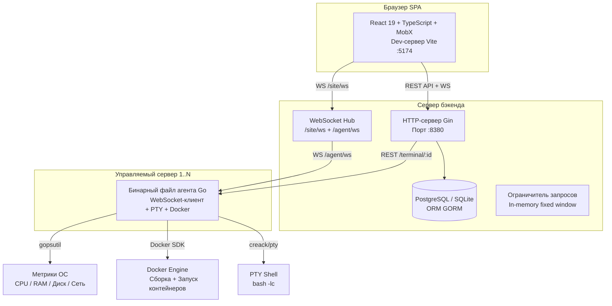
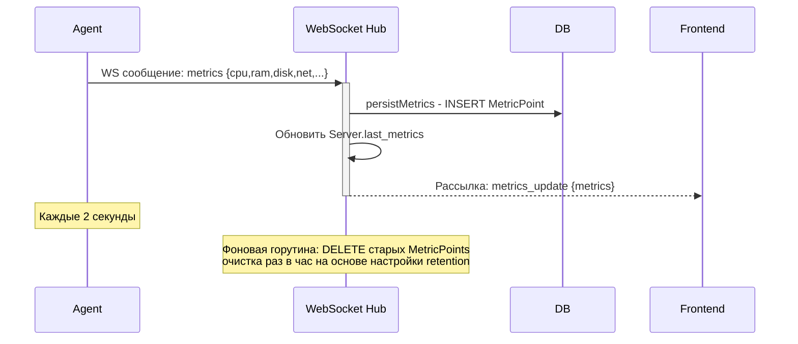
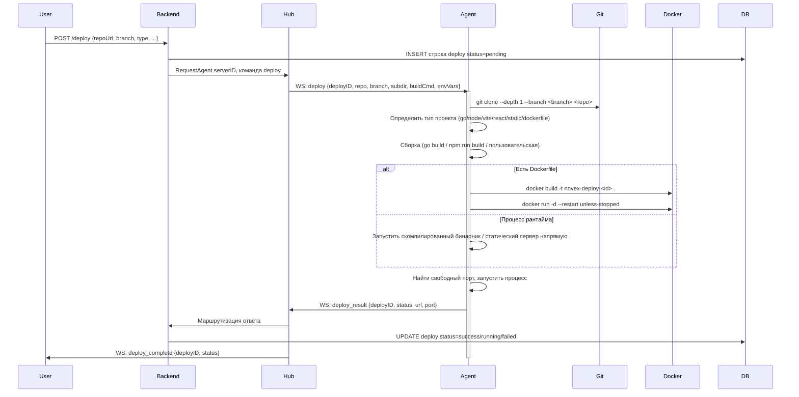
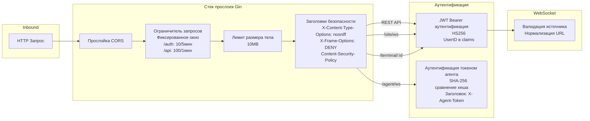
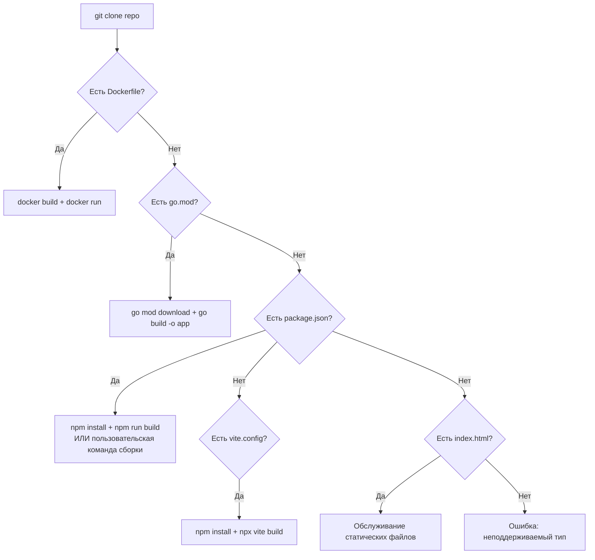

Вот полный перевод архитектурного обзора и анализа кода **NovexPanel** на русский язык.

---

# NovexPanel — Архитектурный обзор и анализ кода

**Проект**: NovexPanel — панель управления серверами с самостоятельным хостингом  
**Стек**: Go 1.22 (бэкенд) + React 19 / TypeScript / MobX (фронтенд)  
**Автор**: botoli  
**Дата обзора**: 2026-04-28  

---

## 1. Системная архитектура

### 1.1 Общая схема

NovexPanel следует **трехуровневой архитектуре** с центральным бэкендом на Go, одностраничным приложением (SPA) на React и легковесными агентами на Go, развернутыми на управляемых серверах.



### 1.2 Каналы связи

| Канал | Направление | Протокол | Эндпоинт | Аутентификация |
|-------|-------------|----------|----------|----------------|
| Фронтенд ↔ Бэкенд (данные) | Двунаправленный | REST (JSON) | `POST/GET/PATCH/DELETE /api/*` | JWT Bearer |
| Фронтенд ↔ Бэкенд (в реальном времени) | Двунаправленный | WebSocket | `/site/ws` | JWT в параметре запроса |
| Агент ↔ Бэкенд (управление) | Двунаправленный | WebSocket | `/agent/ws` | Токен агента в заголовке |
| Браузер ↔ Агент (прямой PTY) | Двунаправленный | WebSocket | `/terminal/:id` | JWT в параметре запроса |
| Бэкенд → Агент (команды) | Запрос/Ответ | WS Envelope | Через Hub `RequestAgent()` | Н/Д (внутри WS) |

### 1.3 Поток данных — метрики в реальном времени



### 1.4 Поток данных — конвейер развертывания



---

## 2. Архитектура бэкенда

### 2.1 Структура модулей

```
backend/
├── cmd/
│   ├── agent/main.go      # Бинарный файл агента (2730 строк) — развертывается на управляемых серверах
│   └── server/main.go     # Бинарный файл бэкенда (63 строки) — точка входа
├── internal/
│   ├── app/               # Основная логика приложения
│   │   ├── app.go             # Маршрутизатор, прослойки, структура App (183 строки)
│   │   ├── hub.go             # WebSocket хаб: клиенты агентов/сайтов, pub/sub (611 строк)
│   │   ├── auth_handlers.go   # Регистрация, вход, управление токенами (355 строк)
│   │   ├── ws_handlers.go     # Маршрутизация WS-сообщений, сохранение метрик (543 строки)
│   │   ├── server_handlers.go # CRUD серверов, история метрик, команды (822 строки)
│   │   ├── deploy_handlers.go # CRUD развертываний, валидация (802 строки)
│   │   ├── terminal_ws_handler.go # Обработчик прямого PTY через WS (359 строк)
│   │   ├── security_middleware.go  # Ограничитель запросов, лимиты тела, заголовки безопасности (169 строк)
│   │   ├── ws_security.go     # Валидация источника WS (100 строк)
│   │   └── utils.go           # parseUintFromString, parseRemoteIP (20 строк)
│   ├── auth/               # Примитивы аутентификации
│   │   ├── jwt.go              # Создание/разбор JWT (HS256)
│   │   ├── agent_token.go      # Генерация токена агента (SHA-256 хеш, base64 raw)
│   │   └── password.go         # Хеширование/сравнение bcrypt
│   ├── config/config.go    # Конфигурация на основе переменных окружения (137 строк)
│   ├── models/models.go    # Модели GORM: User, Server, AgentToken, Deploy и др. (101 строка)
│   └── storage/
│       ├── db.go           # Открытие БД с определением PostgreSQL/SQLite (40 строк)
│       └── migrations.go   # Автомиграции (56 строк)
├── docs/
│   ├── openapi.yaml        # Полная спецификация OpenAPI 3.0 (28+ эндпоинтов)
│   └── ws-protocol.md      # Документация по WebSocket протоколу
└── docker-compose.yml      # PostgreSQL 16
```

### 2.2 Конфигурация (переменные окружения)

| Переменная | Значение по умолчанию | Описание |
|------------|----------------------|-----------|
| `HTTP_ADDR` | `:8380` | Адрес для прослушивания |
| `DATABASE_URL` | `novex.db` | Строка подключения (SQLite если файл, иначе PostgreSQL) |
| `JWT_SECRET` | обязательно | Ключ подписи HS256 (мин. 32 символа) |
| `JWT_TTL` | `72h` | Время жизни токена (поддерживается суффикс `d`) |
| `METRICS_RETENTION` | `24h` | Срок хранения точек метрик |
| `COMMAND_ALLOWLIST` | `systemctl status,docker ps,ls,df -h,ps aux` | Разрешенные удаленные команды |

### 2.3 Модели базы данных (GORM)

```mermaid
erDiagram
    User ||--o{ AgentToken : "создает"
    User ||--o{ Server : "владеет"
    AgentToken ||--o{ Server : "аутентифицирует"
    Server ||--o{ MetricPoint : "имеет историю"
    Server ||--o{ Deploy : "целевой"
    Deploy ||--o{ DeployLog : "логи"
    Server ||--o{ CommandLog : "аудит"

    User {
        uint ID PK
        string Email UK
        string PasswordHash
        string Role
    }
    AgentToken {
        uint ID PK
        uint UserID FK
        string TokenHash UK "SHA-256"
        string TokenPrefix
        bool Revoked
        time Time ExpiresAt
    }
    Server {
        uint ID PK
        uint UserID FK
        uint TokenID FK UK "один агент на сервер"
        string Name
        string IP
        bool Online
        json LastMetrics
    }
    MetricPoint {
        uint ID PK
        uint ServerID FK
        time Timestamp "составной индекс"
        float64 CPUUsage
        float64 RAMPercent
        float64 DiskPercent
        float64 DiskReadSpeed
        float64 DiskWriteSpeed
        float64 NetBytesSent
        float64 NetBytesRecv
        json Raw "полный снимок gopsutil"
    }
    Deploy {
        uint ID PK
        uint ServerID FK
        string Status "pending/running/success/failed"
        string RepoURL
        string Branch
        string ProjectType
        string Subdirectory
        string BuildCommand
        string OutputDir
        json EnvVars
        int Port
        string URL
        text DeployLog
    }
```

### 2.4 REST API эндпоинты (28+)

| Метод | Путь | Описание | Аутентификация |
|-------|------|----------|----------------|
| `GET` | `/healthz` | Проверка здоровья | Нет |
| `POST` | `/auth/register` | Регистрация пользователя (ограничение: 10/5мин) | Нет |
| `POST` | `/auth/login` | Вход (ограничение: 10/5мин) | Нет |
| `GET` | `/auth/me` | Информация о текущем пользователе | JWT |
| `GET` | `/auth/tokens` | Список токенов агентов | JWT |
| `POST` | `/auth/tokens` | Создать токен агента | JWT |
| `PATCH` | `/auth/tokens/:id` | Переименовать токен | JWT |
| `DELETE` | `/auth/tokens/:id` | Отозвать токен | JWT |
| `GET` | `/servers` | Список серверов | JWT |
| `GET` | `/servers/:id/metrics` | История метрик (диапазон/интервал) | JWT |
| `GET` | `/servers/:id/processes` | Список процессов через агента | JWT |
| `POST` | `/servers/:id/command` | Выполнить команду (из разрешенного списка) | JWT |
| `DELETE` | `/servers/:id/processes/:pid` | Завершить процесс | JWT |
| `PATCH` | `/servers/:id` | Обновить имя сервера | JWT |
| `DELETE` | `/servers/:id` | Удалить сервер + развертывания | JWT |
| `POST` | `/servers/:id/deploy` | Устаревший эндпоинт развертывания | JWT |
| `GET` | `/servers/:id/deploys` | Устаревший список развертываний | JWT |
| `GET` | `/deploy` | Список развертываний (с фильтрацией) | JWT |
| `POST` | `/deploy` | Создать развертывание | JWT |
| `GET` | `/deploy/:id` | Получить детали развертывания | JWT |
| `GET` | `/deploy/:id/log` | Получить лог развертывания (агрегированный) | JWT |
| `GET` | `/deploy/:id/logs` | Список записей лога развертывания | JWT |
| `DELETE` | `/deploy/:id` | Остановить + удалить развертывание | JWT |

### 2.5 Архитектура безопасности



### 2.6 Архитектура WebSocket Hub

Hub (`backend/internal/app/hub.go`) — наиболее значимый компонент архитектуры. Он управляет:

- **AgentClient** (на каждое подключение агента): содержит `conn`, `serverID`, `userID`, карту `pending` (map[string]chan json.RawMessage для паттерна запрос/ответ)
- **SiteClient** (на каждое подключение браузера): содержит `conn`, `userID`, наборы подписок на метрики/развертывания/терминалы по serverID
- **TerminalSession**: связывает `serverID` с `SiteClient` для маршрутизации вывода терминала

**Ключевые паттерны:**
- **Запрос/Ответ**: `RequestAgent()` отправляет команду с UUID, создает канал, ожидает с таймаутом
- **Забудь и продолжай**: `SendAgentEvent()` отправляет без ожидания
- **Pub/Sub**: `BroadcastMetrics()` публикует для всех подписанных SiteClient
- **Регистрация**: Агент подключается → аутентифицируется → запись Server создается при необходимости → сохраняется в карте `agents` по serverID

---

## 3. Архитектура агента

Агент (`backend/cmd/agent/main.go`, 2730 строк) — это **автономный бинарный файл Go**, развертываемый на каждом управляемом сервере. Это очень монолитный файл, содержащий:

### 3.1 Обязанности агента

1. **WebSocket-подключение**: Постоянное WS-соединение с экспоненциальной задержкой переподключения (1с → макс. 30с)
2. **Сбор метрик**: Использует `gopsutil` для сбора CPU (процент, средняя нагрузка), RAM, диска (использование + I/O), сети (I/O), процессов, температур — каждые 2 секунды
3. **Конвейер развертывания**: Git clone → определение типа проекта → сборка (npm/go/пользовательская/Dockerfile) → Docker build/run или запуск процесса → проверка здоровья
4. **Управление терминалом**: PTY-сессии через `creack/pty` — открытие, ввод, изменение размера, закрытие
5. **Выполнение команд**: `bash -lc` с таймаутом 60с для shell-команд
6. **Управление процессами**: Список и завершение процессов

### 3.2 Определение типа проекта (агент)

Агент автоматически определяет тип проекта из клонированного репозитория:



### 3.3 Выполнение развертывания (агент)

Конвейер развертывания в агенте детально проработан и включает:
- Защиту от обхода путей для подкаталога
- Определение свободного порта
- Сборку Docker-образов с таймаутами на этапы
- Управление жизненным циклом контейнера (запуск с политикой перезапуска, проверка здоровья, проброс портов)
- Запасной вариант запуска процесса (когда нет Dockerfile)
- Внедрение переменных окружения
- Определение фреймворков фронтенда (Vite, React, Angular, Vue, Svelte, Static)
- Конфигурацию reverse proxy для маршрутизации SPA

---

## 4. Архитектура фронтенда

### 4.1 Дерево компонентов

```
App.tsx (React Router v7)
├── / → HomePage.tsx
│   ├── Карточки серверов с CPU-спарклайном (SVG)
│   ├── Модальное окно добавления сервера
│   └── Кнопки аутентификации (AuthBtns.tsx)
├── /login → Login.tsx
├── /register → Registration.tsx
├── /account → Account.tsx
└── /servers/:id → ServerPage.tsx
    ├── LeftPanel.tsx (боковая навигация)
    ├── /metrics → MetricsPage.tsx
    ├── /terminal → Terminal.tsx (XTerm)
    ├── /processes → ProcessesPage.tsx
    └── /deployments → DeploymentsPage.tsx
        ├── Deploy.tsx (создание развертывания)
        └── /:deployId → DeploymentDetailPage.tsx
```

### 4.2 Управление состоянием (MobX)

| Хранилище | Данные | Сохранение |
|-----------|--------|-------------|
| `TokenStore` | Строка JWT токена | localStorage |
| `AgentTokenStore` | Строка токена агента | Только в памяти |
| `DeployStore` | Текущий ID развертывания | localStorage |
| `ServerMetricsStore` | `ServerItem[]`, состояние загрузки/ошибки | Только в памяти |
| `ServerStore` | Текущий сервер (из параметра URL) | Вычисляется из маршрута |

### 4.3 Получение данных

- **Хук `useLoadServers`**: опрашивает `GET /servers` каждые 2 секунды с дедупликацией запросов
- **Метрики**: в реальном времени через WebSocket `/site/ws` подписка `subscribe_metrics`
- **Терминал**: WebSocket `/terminal/:id` для прямого PTY-взаимодействия (фронтенд XTerm)
- **Развертывания**: REST CRUD с потоковой передачей логов развертывания через WebSocket

### 4.4 Зависимости фронтенда (ключевые)

| Пакет | Назначение |
|-------|-------------|
| React 19 | UI фреймворк |
| TypeScript 6 | Типизация |
| MobX + mobx-react-lite | Управление состоянием |
| React Router v7 | Маршрутизация |
| Vite 8 | Инструмент сборки |
| Recharts | Графики |
| XTerm | Эмулятор терминала |
| MUI | UI компоненты |
| SASS/SCSS | Стилизация |
| @iconify/react | Иконки |

---

## 5. Замечания по качеству кода

### 5.1 Сильные стороны

1. **Всесторонняя документация**: Спецификация OpenAPI + документация WS протокола в `/docs`
2. **Хорошо организованный бэкенд**: Чистое разделение на `internal/app`, `internal/auth`, `internal/config`, `internal/models`, `internal/storage`
3. **Надежная валидация развертываний**: Проверка URL репозиториев (только HTTPS/SSH), шаблонов веток, защита от обхода путей, лимиты переменных окружения
4. **Хорошие практики безопасности**:
   - Токены агентов хранятся как SHA-256 хеш, полный токен показывается только один раз при создании
   - Bcrypt хеширование паролей
   - JWT с фиксацией алгоритма (только HS256)
   - Ограничение запросов для эндпоинтов аутентификации
   - Заголовки безопасности (CSP, X-Frame-Options, X-Content-Type-Options)
   - Валидация источника WS
   - Лимиты размера тела (10MB)
5. **Поддержка двух СУБД**: PostgreSQL для продакшена, SQLite для разработки/тестирования
6. **Корректное завершение работы**: Обработка сигналов SIGINT/SIGTERM
7. **Фоновая очистка**: Фоновая горутина для хранения метрик

### 5.2 Проблемы и рекомендации

#### 🔴 ВЫСОКИЙ ПРИОРИТЕТ: Монолит агента (2730 строк в одном файле)

Бинарный файл агента представляет собой один файл размером 2730 строк. Это сильно затрудняет тестирование, поддержку и проверку кода. Все функции находятся в пакете `main` без разделения ответственности.

**Рекомендация**: Разделить на пакеты:
- `internal/metrics/` — сбор gopsutil
- `internal/deploy/` — конвейер развертывания
- `internal/terminal/` — управление PTY
- `internal/wsclient/` — WebSocket-клиент
- `cmd/agent/main.go` — только связывание компонентов

#### 🔴 ВЫСОКИЙ ПРИОРИТЕТ: Уязвимость безопасности токена агента

Токены агентов отправляются как параметры запроса в URL при обновлении WebSocket:

```go
u := url.URL{Scheme: wsScheme, Host: a.cfg.ServerAddr, Path: "/agent/ws"}
u.RawQuery = "token=" + url.QueryEscape(a.cfg.Token)
```

Параметры запроса часто логируются прокси-серверами, балансировщиками нагрузки и веб-серверами. Это приводит к утечке токена агента.

**Рекомендация**: Отправлять токен как заголовок подпротокола WebSocket или пользовательский HTTP-заголовок при обновлении. Сервер уже читает заголовок `X-Agent-Token` в `handleAgentWS` — агент должен отправлять его так.

#### 🟡 СРЕДНИЙ ПРИОРИТЕТ: Избыточные эндпоинты развертывания

Существует два потока развертывания:
1. `POST /servers/:id/deploy` + `GET /servers/:id/deploys` (устаревший)
2. `POST /deploy` + `GET /deploy` (текущий)

Устаревшие эндпоинты в `server_handlers.go` содержат дублированную логику с новыми эндпоинтами в `deploy_handlers.go`. Это создает путаницу и увеличивает сложность поддержки.

**Рекомендация**: Объявить устаревшими и удалить эндпоинты `/servers/:id/deploy`.

#### 🟡 СРЕДНИЙ ПРИОРИТЕТ: Жестко закодированная shell-команда

Агент использует жестко заданную команду `bash -lc` для выполнения команд:

```go
cmd := exec.CommandContext(ctx, "bash", "-lc", command)
```

Это специфично для Linux и не работает в системах без bash. Кроме того, внедрение shell-кода тривиально возможно, так как команды передаются как одна строка.

**Рекомендация**:
- Использовать `exec.Command` с отдельными аргументами, где возможно
- Добавить поддержку `/bin/sh` в качестве запасного варианта
- Рассмотреть подход только с разрешенным списком команд (уже частично реализован в бэкенде)

#### 🟡 СРЕДНИЙ ПРИОРИТЕТ: Отсутствие тестов

В проекте не найдено ни одного файла `_test.go`. Это существенный пробел для проекта такой сложности.

**Рекомендация**: Добавить модульные тесты для:
- Обработчиков аутентификации (вход, регистрация, управление токенами)
- Логики валидации развертываний
- Паттерна запрос/ответ в Hub
- Этапов конвейера развертывания агента
- Сохранения и агрегации метрик

#### 🟡 СРЕДНИЙ ПРИОРИТЕТ: Смешение состояния на фронтенде

Фронтенд использует смесь:
1. MobX-хранилищ (`ServerMetricsStore`, `TokenStore` и т.д.)
2. React контекста / параметров URL (`useCurrentServer`)
3. Локального состояния компонентов (`useState` для форм)

Эта несогласованность может приводить к ошибкам синхронизации состояния.

**Рекомендация**: Стандартизировать использование MobX-хранилищ для всего глобального состояния приложения, оставив локальное состояние только для временных UI-задач.

#### 🟡 СРЕДНИЙ ПРИОРИТЕТ: Отсутствие границ ошибок на фронтенде

Не найдено ни одной React-границы ошибок (Error Boundary). Ошибка времени выполнения в любом компоненте может привести к падению всего SPA.

**Рекомендация**: Добавить компонент Error Boundary верхнего уровня.

#### 🟢 НИЗКИЙ ПРИОРИТЕТ: Несоответствие валидации пароля

Фронтенд проверяет, что пароль имеет длину >= 6 символов, но бэкенд использует `bcrypt.DefaultCost` без минимальной длины. Обработчик регистрации в `auth_handlers.go` не проверяет длину пароля.

**Рекомендация**: Добавить серверную валидацию пароля (например, минимум 8 символов, хотя бы одна цифра/спецсимвол).

#### 🟢 НИЗКИЙ ПРИОРИТЕТ: Валидация JWT секрета

Конфигурация требует, чтобы `JWT_SECRET` был >= 32 символов, но не проверяет энтропию или разнообразие символов.

#### 🟢 НИЗКИЙ ПРИОРИТЕТ: Отсутствие абстракции API на фронтенде

API-вызовы используют сырой `fetch()` непосредственно в компонентах (Login, Registration, HomePage). Нет централизованного API-клиента, нет перехватчиков запросов, нет абстракции обработки ошибок.

**Рекомендация**: Создать класс/модуль API-клиента с:
- Оберткой `fetch` с внедрением JWT
- Автоматической обработкой 401 → перенаправление на логин
- Типизированными ответами
- Перехватчиками запросов/ответов

#### 🟢 НИЗКИЙ ПРИОРИТЕТ: Отсутствие санитизации ввода в терминале

Обработчик WebSocket терминала напрямую записывает пользовательский ввод в PTY. Если фронтенд отправляет бинарные фреймы, они записываются напрямую. Хотя это ожидаемое поведение PTY, нет ограничения скорости на ввод в терминале.

#### 🟢 НИЗКИЙ ПРИОРИТЕТ: Усечение предпросмотра логов развертывания

Модель `DeployLog` не имеет явного ограничения длины для текстового поля, и логи развертывания могут стать очень большими для длительных сборок.

#### 🟢 НИЗКИЙ ПРИОРИТЕТ: Утечка переменных окружения

Переменные окружения развертывания возвращаются полностью из `GET /deploy/:id`:

```go
c.JSON(http.StatusOK, gin.H{"deploy": deploy})
```

Это раскрывает переменные окружения (которые могут содержать секреты вроде API-ключей) в API-ответах. Возможно, фронтенду они нужны, но это должно быть хотя бы задокументировано или отфильтровано для пользователей, не являющихся владельцами.

---

## 6. Соображения производительности

| Аспект | Наблюдение |
|--------|-------------|
| Опрос метрик | Агент отправляет каждые 2 секунды; бэкенд отправляет всем подписчикам + сохраняет в БД. В масштабе (100+ серверов) создает значительную нагрузку на запись в БД |
| Очистка хранения метрик | Фоновая горутина запускается каждый час. `DELETE FROM metric_points WHERE timestamp < cutoff` может быть медленным на больших таблицах без правильной индексации |
| Конкуренция в Hub | Hub использует `sync.RWMutex` для карт клиентов агентов/сайтов. При высокой конкурентности (много агентов + много сайтов) может стать узким местом |
| Валидация развертывания | Выполняется в горутине обработчика HTTP. Проверка репозиториев и шаблонов веток в порядке, но разрешение пути подкаталога может блокироваться |
| Переподключение агента | Экспоненциальная задержка от 1с до максимума 30с. В масштабе синхронизированное переподключение (thundering herd) после сетевого события может перегрузить бэкенд |
| Опрос фронтенда | `useLoadServers` опрашивает `/servers` каждые 2 секунды. В сочетании с real-time WS метриками это избыточно для данных списка серверов |

---

## 7. Итог аудита безопасности

| Находка | Серьезность | Статус |
|---------|-------------|--------|
| Токен агента в параметре запроса WS | 🔴 ВЫСОКИЙ | Существует |
| Нет требований к сложности пароля | 🟢 НИЗКИЙ | Существует |
| Переменные окружения развертывания раскрыты в API-ответе | 🟢 НИЗКИЙ | Существует |
| Фиксация алгоритма JWT (HS256) | ✅ ХОРОШО | Реализовано |
| Bcrypt хеширование паролей | ✅ ХОРОШО | Реализовано |
| Ограничение запросов на эндпоинтах аутентификации | ✅ ХОРОШО | Реализовано |
| Заголовки безопасности (CSP, XFO, XCTO) | ✅ ХОРОШО | Реализовано |
| Лимит размера тела (10MB) | ✅ ХОРОШО | Реализовано |
| Конфигурация CORS | ✅ ХОРОШО | Реализовано |
| Токен агента показывается один раз, хранится SHA-256 | ✅ ХОРОШО | Реализовано |
| Валидация ввода развертывания (репозиторий, ветка, путь) | ✅ ХОРОШО | Реализовано |
| Разрешенный список команд для удаленного выполнения | ✅ ХОРОШО | Частично реализовано |

---

## 8. Резюме и рекомендуемый план действий

### Порядок приоритетов

1. **Разделить монолит агента** на пакеты (`cmd/agent/main.go` → `internal/agent/*`)
2. **Переместить токен агента из параметра запроса WS в заголовок**
3. **Объявить устаревшими и удалить старые эндпоинты развертывания** (`/servers/:id/deploy`)
4. **Добавить тесты** — начать с обработчиков аутентификации и валидации развертываний
5. **Стандартизировать состояние на фронтенде** последовательно используя MobX
6. **Добавить границы ошибок в React-приложение**
7. **Добавить серверную валидацию пароля**
8. **Создать централизованный API-клиент на фронтенде**
9. **Рассмотреть масштабируемость Hub** — партиционированные мьютексы или шардированные карты клиентов
10. **Оптимизировать очистку хранения метрик** с помощью пакетного удаления

### Оценка архитектуры: **B+**

NovexPanel — это хорошо структурированный проект с четким разделением на бэкенд, фронтенд и компоненты агента. Паттерн WebSocket Hub хорошо реализован для связи в реальном времени. Основные области для улучшения — организация кода (монолит агента), покрытие тестами и несколько моментов усиления безопасности.